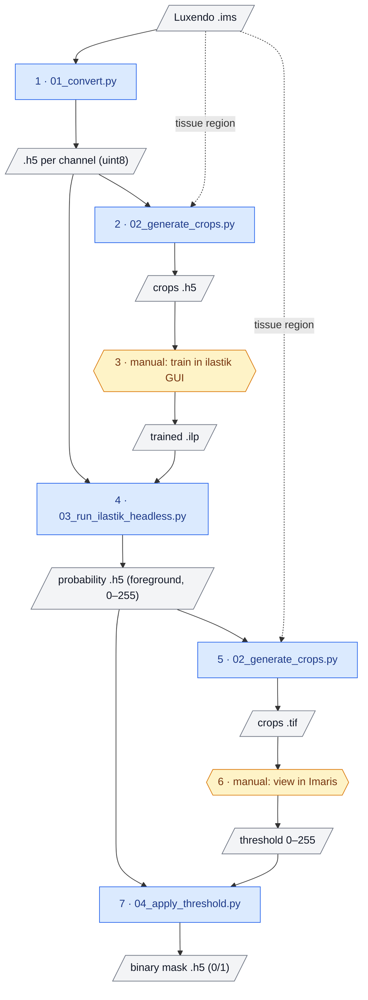

# Skeleton Pipeline

Input: reconstructed `.ims` file by Luxendo.

| Step | Script | Input | Output | What it does |
|---|---|---|---|---|
| 1 | `01_convert.py` | `.ims` | one 8-bit `.h5` per channel, `-meta.json` | Converts every channel to uint8, chunked, gzip-compressed `.h5` for ilastik |
| 2 | `02_generate_crops.py` | `.h5` (step 1), `.ims` | crops (`.h5`), `meta.json`, overview `.png` | Cuts random crops from the tissue region, for training ilastik |
| 3 | manual (ilastik GUI) | crops (step 2) | trained `.ilp` | Train the pixel classifier: label foreground / background |
| 4 | `03_run_ilastik_headless.py` | `.h5` (step 1), trained `.ilp` (step 3) | probability `.h5` (uint8, foreground only) | Runs the trained pixel classifier headless on the full volume |
| 5 | `02_generate_crops.py` | probability `.h5` (step 4), `.ims` | crops (`.tif`), `meta.json`, overview `.png` | Cuts random crops from the probability map, for viewing |
| 6 | manual (Imaris) | crops (step 5) | threshold 0–255 | View the crops and decide on the threshold |
| 7 | `04_apply_threshold.py` | probability `.h5` (step 4), threshold (step 6) | binary mask `.h5` (0/1), `-meta.json` | Thresholds the probabilities into a foreground mask |

